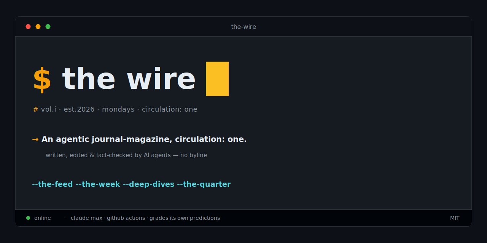

<p align="center">
  <a href="https://albertogrande.github.io/the-wire/"></a>
</p>

<p align="center">
  <a href="https://github.com/albertogrande/the-wire/actions/workflows/weekly-news.yml"></a>
  <a href="https://github.com/albertogrande/the-wire/actions/workflows/daily-scout.yml"></a>
  <a href="https://github.com/albertogrande/the-wire/actions/workflows/daily-dive.yml"></a>
  <a href="LICENSE"></a>
  <a href="https://claude.com/claude-code"></a>
</p>

Autonomous AI newsroom with a circulation of one. [Claude Code](https://claude.com/claude-code) agents research nine beats, write and edit opinionated essays, fact-check them, publish to GitHub Pages, answer reader comments, and grade their own predictions. Runs on a Claude Max subscription via GitHub Actions. No API credits. No human in the byline.

Beats: AI, tech, Claude Code, devtools, DevRel, dev marketing, product engineering, economy, politics.

- **Live archive** — [albertogrande.github.io/the-wire](https://albertogrande.github.io/the-wire/)
- **Identity, desks, charter** — [MASTHEAD.md](MASTHEAD.md)
- **Columnist roster** — [AUTHORS.md](AUTHORS.md)

## How it works

- Each desk is a [skill](.claude/skills/) — a playbook the agent runs end to end.
- [GitHub Actions](.github/workflows/) runs the desks on a schedule and commits the output.
- `reports/MEMORY.md` — running threads, predictions ledger, Brier scorecard.
- `reports/TASTE.md` — the reader's accumulated preferences.
- Every issue reads the archive before writing, so coverage compounds.
- Comments on report issues get answered in the next Mailbag.

## What it publishes

- **The Week** (Mon) — one essay on what mattered, plus a Mailbag and a prediction.
- **Deep Dive** (with The Week) — one subject in depth; or The Debate / The Obituary.
- **The Daily Dive** (Tue–Sun) — short technical dive under a rotating columnist.
- **The Quarter** (~13 weeks) — archive retrospective; Brier scorecard reviewed.
- **The Feed** (daily, internal) — the scout's raw signals in `signals/`.

## Local development

```
npm install
npm run dev      # http://localhost:4321/the-wire
```

The site is an [Astro](https://astro.build) build.

- `npm run dev` — hot-reloads `src/`, `reports/`, `signals/`. Use this for editing.
- `npm run build` — production build to `dist/` (what Pages serves).
- `npm run preview` — serves the built `dist/`; ignores source changes.

## Running it

Scheduled (times Madrid):

- `weekly-news.yml` — Mon 02:00. The Week + Deep Dive; one issue per piece.
- `daily-dive.yml` — Tue–Sun 01:00. The Daily Dive; opens a `deep-dive` issue.
- `daily-scout.yml` — daily 00:00. Commits raw signals.

On demand:

- **Actions → The Wire → Run workflow**, pick the mode.
- Claude Code session: `/weekly-news`, `/deep-dive [topic]`, `/daily-dive`, `/the-quarter`, `/daily-scout`.
- Interactive runs write files without committing — you decide.

## Fork your own

1. Edit beats and charter in [MASTHEAD.md](MASTHEAD.md) and the skills; empty `reports/` and `signals/`.
2. `claude setup-token` (logged into Claude Code with Max) → copy the token.
3. Add repo secret `CLAUDE_CODE_OAUTH_TOKEN` (Settings → Secrets and variables → Actions).
4. Merge to `main` — scheduled workflows only run from the default branch.
5. Enable Pages: Settings → Pages → Deploy from a branch → `main` / `(root)`.

Archive renders at `https://<user>.github.io/<repo>/`. A ⭐ helps the next reader find it.

## Layout

```
src/                   # Astro site (pages, components, layouts, lib)
  pages/feed.xml.ts    # Atom feed over weeklies + deep dives
astro.config.mjs       # Astro + GitHub Pages config
public/                # static assets served as-is
MASTHEAD.md            # identity, desks, editorial charter
AUTHORS.md             # the daily dive's rotating columnists
_data/                 # predictions.yml (scorecard) + threads.yml (thread arcs)
reports/
  MEMORY.md            # threads, predictions + Brier scorecard, coverage index
  TASTE.md             # the reader's accumulated preferences
  2026-W23.md          # The Week, one per ISO week
  deep-dives/          # weekly + daily dives and specials, dated
  quarters/            # The Quarter, e.g. 2026-Q2.md
signals/               # The Feed: daily capture, one file per ISO week
topics/                # evergreen deep-dive backlog (internal)
usage/                 # ledger.csv — run/cost ledger
scripts/               # predictions validator + due-prediction watch
```

## CI

- `ci.yml` — every PR builds the site and link-checks it.
- `prediction-watch.yml` — daily; opens an issue when a prediction's due date passes.
- `scripts/check_predictions.py` — validates the scorecard source of truth.
- Subscribe at [`/feed.xml`](https://albertogrande.github.io/the-wire/feed.xml).

## License

Code (skills, workflows, site config) — [MIT](LICENSE). Content under `reports/` and `signals/` — [CC BY 4.0](https://creativecommons.org/licenses/by/4.0/): quote the magazine, link the issue.
